# **Tribe**
## **Site Overview**
Welcome to Tribe - the number one destination for the African and Caribbean community. Here at Tribe we foster a passion to connect and enhance the African and Caribbean communities in rural areas. Connect with others by joining activities being hosted by people like yourself, or host your own activity. Find Black Owned businesses providing the products and services you need, using the business directory. Build new relationships with the secure profile portal which includes a chat function. 

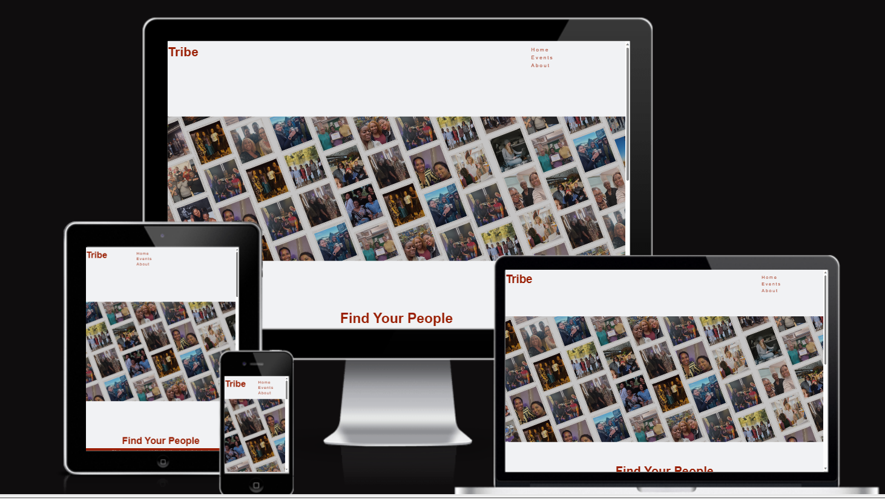

## Table of contents:
1. [**Site Overview**](#site-overview)
1. [**Planning stage**](#planning-stage)
    * [***Target Audiences***](#target-audiences)
    * [***User Stories***](#user-stories)
    * [***Site Aims***](#site-aims)
    * [***How Is This Will Be Achieved:***](#how-this-will-be-achieved)
    * [***Wireframes***](#wireframes)
    * [***Color Scheme***](#color-scheme)
    * [***Technology Used***](#Technology-Used)
    * [***Languages Used***](#Languages-Used)
    * [***Frameworks, Libraries & Programs Used***](#Frameworks,-Libraries-&-Programs-Used)
1. [**Current Features Common to all pages**](#current-features-common-to-all-pages)
    * [***Header Element:***](#header-element)
        * [*Title*](#title)
        * [*Logos*](#logos)
        * [*Navigation Bar*](#navigation-bar)
        * [*African Print Design*](#African-Print-Design)    
    * [**Footer**](#footer)
1. [**Future-Enhancements**](#future-enhancements)
1. [**Testing Phase**](#testing-phase)
        * [*Testing*](#Testing)
        * [*Testing User Stories from User Experience (UX) Section*](#Testing-User-Stories-from-User-Experience-(UX)-Section)
        * [*First Time Visitor Goals*](#First-Time-Visitor-Goals)
        * [*Returning Visitor Goals*](#Returning-Visitor-Goals)
        * [*Frequent User Goals*](#Frequent-User-Goals)
        * [*Further Testing*](#Further-Testing)
1. [**Accessibility**](#Accessibility)
1. [**Known Bugs**](#Known-Bugs)
1. [**Deployment**](#deployment)
1. [**Credits**](#credits)
    * [**Honourable mentions**](#honorable-mentions)
    * [**General reference**](#general-reference)
    * [**Content**](#content)
    * [**Media**](#media)

## **Planning stage**
### **Target Audiences:**
* Members of the African and Caribbean Community 
* Users who want to meet others, explore their local area and foster new relationships.
* Users who are looking for businesses which represents their needs.
* Users who own businesses which the target audience would be interested in.

### **User Stories:**
* As a user, I want to see upcoming events.
* As a user, I want to be able to search for events based on certain search criteria e.g. location, date, activity type.
* As a user, I want to navigate through the site with ease.
* As a user, I want to know my information is secure to enable me to interact with others confidently.
* As a user, I want the ability to find businesses local to me which offer the product or service for my needs.

### **Site Aims:**
* To create a safe and welcoming, dedicated space for the African and Caribbean community.
* To provide activities to promote social interactions, cultural connections, relationship building, business awareness and a sense of community.
* Represent the African and Caribbean community
* Enable users to interact with the site through thier profile, hostign activities and promoting their business.

### **How This Will Be Achieved:**
* The Activities page will showcase upcoming activities for users to RSVP.
* When users are logged into the site they will see the activities sign up for and the ability to contact others, with a profile, who are also attending the activity and the host.
* Activities will can be filtered based on popular search criteria e.g. location, activity type.
* Users will be able to log into a profile and personalise this to enable communication with others and the activity host - using a verification process. ( users who are not logged in can send RSVP or questions using the feedback forms provided.) 

* Notifications can be turned on to enable users with an account to receive updates.

### **Wireframes:**
I used Balsamiq to create a visual representation of the Tribe site - below are the initial idea designs:

* Desktop Wireframes:
    * 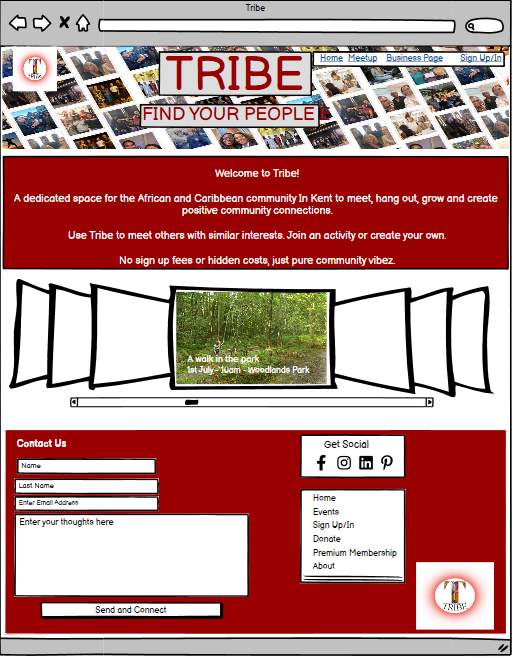
    * 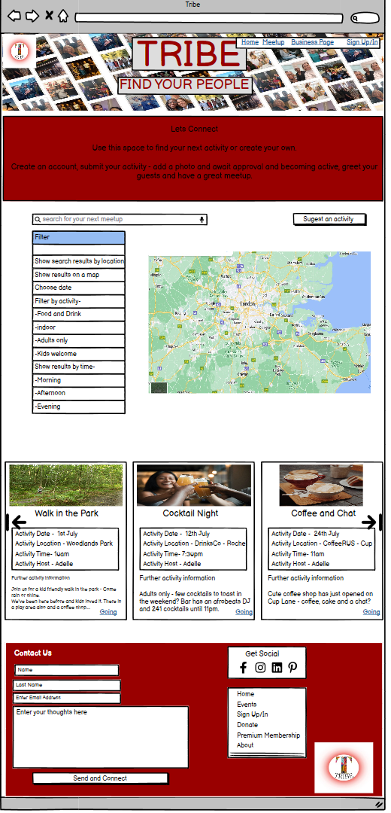
    * 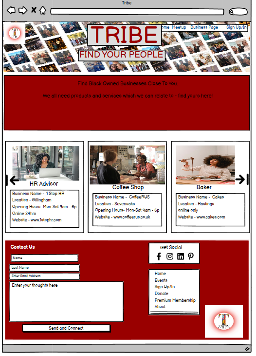
    * 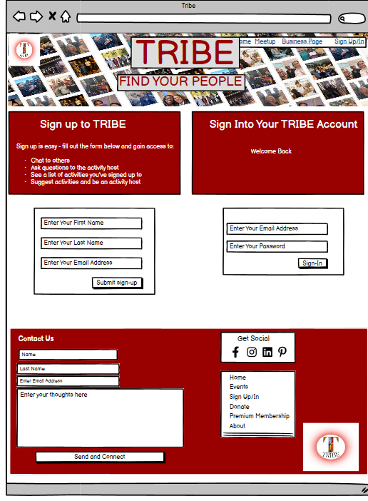

There was some deviation from the original wireframes due to time and additional functionality needed to support the designs

* The Business page were not created due to the need for backend functionality which was out of the scope of this project.
* The signup page also required the need for backend functionality, a standard form is used to enable people to RSVP to events on the activities page, currently, and the sign in page has been omitted until the backend functionality is available.
* The ability to search and use a map functionality also required backend functionality and were left out at this stage.
* To improve the User experience, the hero image was removed from all pages except the index page, as users could not differentiate between pages when using the navigation bar until they scrolled down. 
* Social media links were omitted at this stage as these have not been created yet to support the website. 

### **Color Scheme:**
I wanted the colour scheme to be a dark colour which contrasted a white background, I choose rgba(153,30,2, 1) Totem pole for the main background colours and the main font colours. Contrasting with a white font colour against the totem pole background. I have also used black font in places where I felt it was needed to differentiate between areas. 

This color also complimented the African print design I wanted to incorporate into the website - I used this as a background on the activity elements of the site.

### **Technology Used:**
## Languages Used

-   [HTML5](https://en.wikipedia.org/wiki/HTML5)
-   [CSS3](https://en.wikipedia.org/wiki/Cascading_Style_Sheets)

### Frameworks, Libraries & Programs Used

1. [Hover.css:](https://ianlunn.github.io/Hover/)
    - Hover.css was used on the navigation links
1. [Font Awesome:](https://fontawesome.com/)
    - Font Awesome was used on the forms on the activity page. Further icons will be used for the social media icons, once accounts have been set up.
1. [Git](https://git-scm.com/)
    - Git was used for version control by utilizing the command line terminal to commit to Git and Push to GitHub.
1. [GitHub:](https://github.com/)
    - GitHub was used to store the project code after being pushed from Git.
1. [Canva:](https://www.canva.com/)
    - Canva was used to create the logo and to create the hero image.
1. [Balsamiq:](https://balsamiq.com/)
    - Balsamiq was used to create the [wireframes](https://github.com/) during the design process.
1. [ImageColorPicker:](https://imagecolorpicker.com/)
    -Image Color Picker was used to select the colors for my background, container backgrounds and text. 
1. [Activities gallery:] (https://github.com/Patalin/CSS-Image-Hover-Effect/tree/main) 
    - code used to make the gallery on the activities page interactive. 

## **Current Features Common to all pages**
###  **Header Element**
The header is used throughout the site to hold the navigation bar and the site title.

### *Logos:*
* Although a logo was created, I found this difficult to align on the page, so it was omitted due to time restraints.
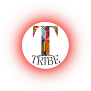

### *Navigation Bar:*
* The navigation bar appears on all three pages. 
* It contains links to the Activities and About pages.
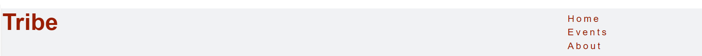

### *African Print Design:*
* This print was integral to ensure there was a recognisable cultural element within the site - this is used as a border around activities.
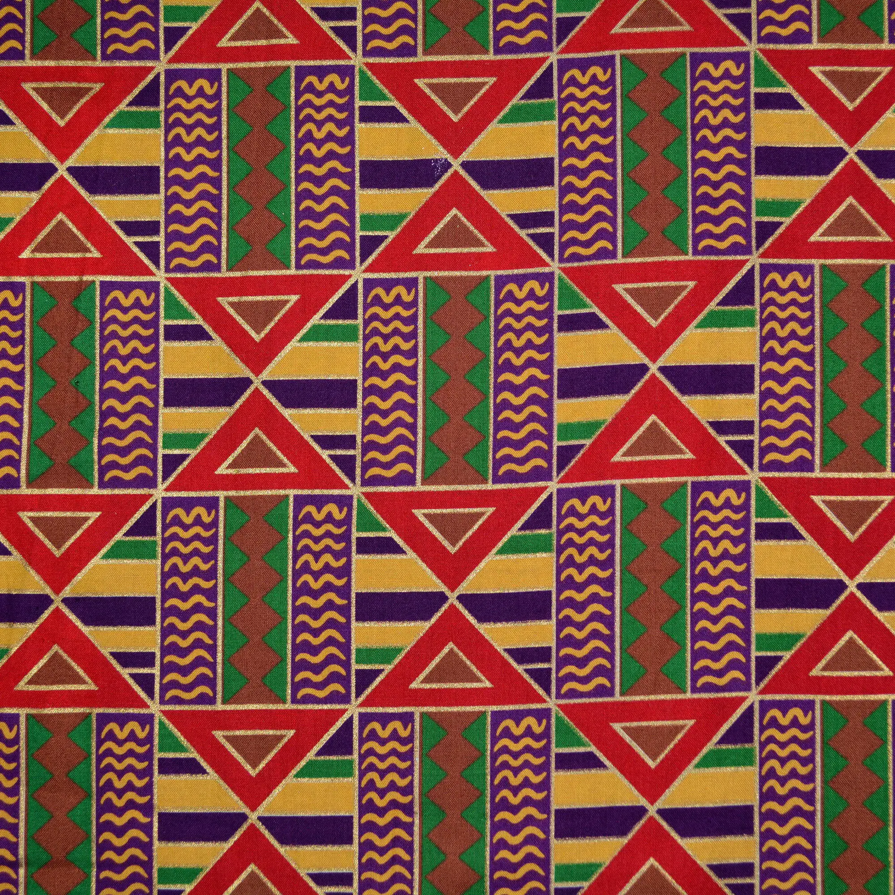

## **Footer**
* The footer holds icons to access social media sites and an email functionality to contact us, this is replicated throughout the site.

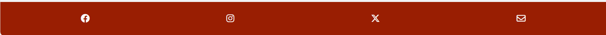

## **Future-Enhancements**

* In the future, this site will enable locality hubs - to enable nation-wide activities.

* I would also like to include activities which are based abroad, female only trips etc.

* I would also like to host business podcasts or a blog, where Black Owned businesses could talk more about their services or products and where start ups could connect with the established community and gain resources while they start their entrepreneurial journey.

* With the backend functionality I will be able to include aspects like searchable activities and businesses, a profile area and chat function.

* There should also be a payment element to enable bigger activities where a charge/booking fee/ reservation fee may be needed. 

* To support growth, I will link social media and google accounts. I will also enable sign up functionality where I can store and use contact information for marketing and promotional material.

### **Testing Phase**

## **Testing**

The W3C Markup Validator and W3C CSS Validator Services were used to validate every page of the project to ensure there were no syntax errors in the project.

-   [W3C Markup Validator](https://validator.w3.org/nu/) 
    
    Homepage:

    Intial tests show various errors to be corrected.
    
    After fixing the errors, the final test results confirm no errors or warnings.
    

    Event Page:

    Intial tests show various errors to be corrected.
    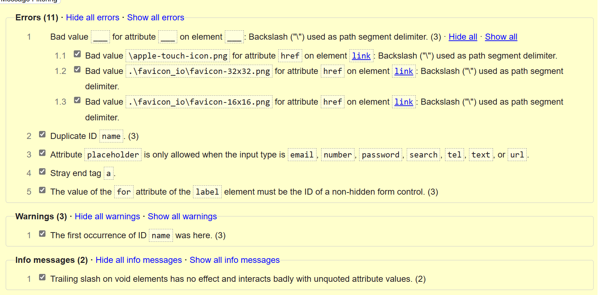
    After fixing the errors, the final test results confirm no errors or warnings.
    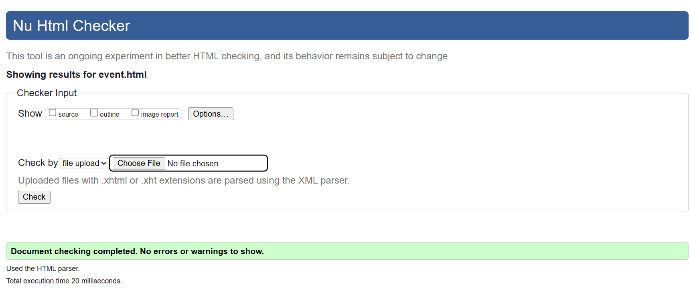

    About:

    Intial tests show various errors to be corrected.
    
    After fixing the errors, the final test results confirm no errors or warnings.
    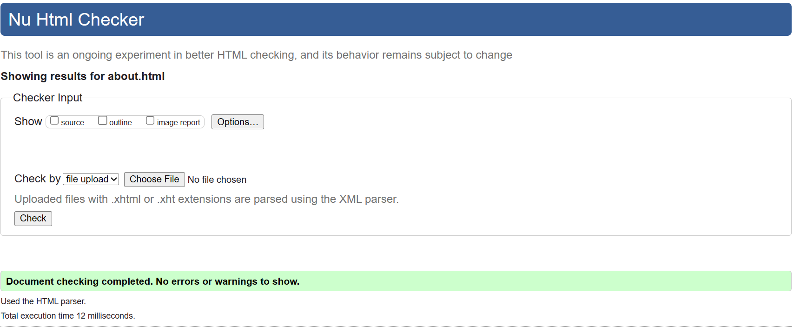

-   [W3C CSS Validator](https://jigsaw.w3.org/css-validator/#validate_by_input) - [Results](https://github.com/)

### Testing User Stories from User Experience (UX) Section

-   #### First Time Visitor Goals

    1. As a First Time Visitor, I want to easily understand the main purpose of the site and learn more about the organisation.

        1. Upon entering the site, users are automatically greeted with a clean and easily readable navigation bar to go to the page of their choice. Underneath there is a Hero Image with Text and a "Learn More" Call to action button.
        2. The main points are made immediately with the hero image
        3. The user has two options, click the call to action buttons or scroll down, both of which will lead to the same place, to learn more about the organisation.

    2. As a First Time Visitor, I want to be able to easily be able to navigate throughout the site to find content.

        1. The site has been designed to be fluid and never to entrap the user. At the top of each page there is a clean navigation bar, each link describes what the page they will end up at clearly.
        2. At the bottom of the first 3 pages there is a redirection call to action to ensure the user always has somewhere to go and doesn't feel trapped as they get to the bottom of the page.
        3. On the Contact Us Page, after a form response is submitted, the page refreshes and the user is brought to the top of the page where the navigation bar is.

    3. As a First Time Visitor, I want to look for testimonials to understand what their users think of them and see if they are trusted. I also want to locate their social media links to see their following on social media to determine how trusted and known they are.
        1. Once the new visitor has read the About Us and What We Do text, they will notice the Why We are Loved So Much section.
        2. The user can also scroll to the bottom of any page on the site to locate social media links in the footer.
        3. At the bottom of the Contact Us page, the user is told underneath the form, that alternatively they can contact the organisation on social media which highlights the links to them.

-   #### Returning Visitor Goals

    1. As a Returning Visitor, I want to find the new programming challenges or hackathons.

        1. These are clearly shown in the banner message.
        2. They will be directed to a page with another hero image and call to action.

    2. As a Returning Visitor, I want to find the best way to get in contact with the organisation with any questions I may have.

        1. The navigation bar clearly highlights the "Contact Us" Page.
        2. Here they can fill out the form on the page or are told that alternatively they can message the organisation on social media.
        3. The footer contains links to the organisations Facebook, Twitter and Instagram page as well as the organization's email.
        4. Whichever link they click, it will be open up in a new tab to ensure the user can easily get back to the website.
        5. The email button is set up to automatically open up your email app and autofill their email address in the "To" section.

    3. As a Returning Visitor, I want to find the Facebook Group link so that I can join and interact with others in the community.
        1. The Facebook Page can be found at the footer of every page and will open a new tab for the user and more information can be found on the Facebook page.
        2. Alternatively, the user can scroll to the bottom of the Home page to find the Facebook Group redirect card and can easily join by clicking the "Join Now!" button which like any external link, will open in a new tab to ensure they can get back to the website easily.
        3. If the user is on the "Our Favourites" page they will also be greeted with a call to action button to invite the user to the Facebook group. The user is incentivized as they are told there is a weekly favourite product posted in the group.

-   #### Frequent User Goals

    1. As a Frequent User, I want to check to see if there are any newly added challenges or hackathons.

        1. The user would already be comfortable with the website layout and can easily click the banner message.

    2. As a Frequent User, I want to check to see if there are any new blog posts.

        1. The user would already be comfortable with the website layout and can easily click the blog link

    3. As a Frequent User, I want to sign up to the Newsletter so that I am emailed any major updates and/or changes to the website or organisation.
        1. At the bottom of every page their is a footer which content is consistent throughout all pages.
        2. To the right hand side of the footer the user can see "Subscribe to our Newsletter" and are prompted to Enter their email address.
        3. There is a "Submit" button to the right hand side of the input field which is located close to the field and can easily be distinguished.

### Further Testing

-   The Website was tested on Google Chrome, Internet Explorer, Microsoft Edge and Safari browsers.
-   The website was viewed on a variety of devices such as Desktop, Laptop, iPhone7, iPhone 8 & iPhoneX.
-   A large amount of testing was done to ensure that all pages were linking correctly.
-   Friends and family members were asked to review the site and documentation to point out any bugs and/or user experience issues.

### Accessibility
I wanted to ensure the site supported all visitors, I included the following in my code to ensure this:

* All images contained an alt tag
* All images were converted into WEBP, a reduced file size to support the load time of images (https://convertio.co/webp-converter/)
* The site is responsive to different screen sizes 
* I used semantic elements throughout the design

### ***Known Bugs***

* adding the bootstrap link caused the border image to disable. 
    - Solution:  removed bootstrap link and used CSS to obtain result.
* adding event listener to map caused map to disappear 
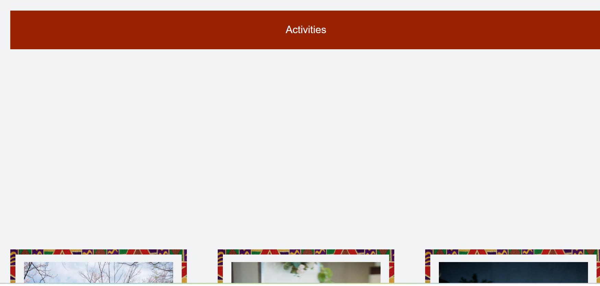 
    - Solution: although I was able to fix this bug by editing the code, I did remove this functionlaity due to increased need for javascript to fully deliver what I wanted from the map. opted for this project, to just use an image. 
* I was unable to see why the middle image on the index.html page was longer than the other images. From using the inspect tool - all attributes for the three containers were the same. 
    - solution: bug not fixed due to time restaints. 
* I was unable to contain the text within the back of the flip cards when the device screen was being resized. 
    - solution: bug not fixed due to time restraints
* I was unable to change the nav bar to be on one line when the screen size was a laptop or bigger. It is currently stacked.
    -solution: bug not fixed due to time restraints.    

## **Deployment**
I deployed the page on GitHub pages via the following procedure: -

1. From the project's [repository](https://github.com/AdelleKing/Tribe), go to the **Settings** tab.
2. From the left-hand menu, select the **Pages** tab.
3. Under the **Source** section, select the **Main** branch from the drop-down menu and click **Save**.
4. A message will be displayed to indicate a successful deployment to GitHub pages and provide the live link.

***
## **Credits**
### **Honourable mentions**
This project could not have happened without the support of the following people listed in no particular order:

* [Komal Karir ](https://github.com/kkarir-waes) - My course tutor who was always on hand whenever I had a question and also provided great insight into the world of software development.

* Luke Buchanan - My Code Institute mentor was able to see what I was trying to create and helped me simplify my code - a lot of 'Oh I see' moments - thank you.

* The slack channels and other online support forums where I found a wealth of information, great inspiration and the courage to carry on through the difficult times of this project.

### **General reference:**
* I really enjoyed using this website, the use of borders and colours really engaged me. I was unable to use any of the inspiration from this site in my own as the imagery was graphic design based - however, I did take inspiration from here.[Peanut](https://www.peanut-app.io/about-us)

* I relied upon W3schools, youtube and stack overflow for general 'how to's' throughout the project alongside course material from Code Institute. 

### **Content:**
* Most of the content was written by myself.
* Icons in the forms were taken from [Font Awesome](https://fontawesome.com) 
* Accessibility checker - [WAVE - Web accessibility evaluation tool](https://wave.webaim.org/)
  
### **Media:**
* Images used for activities were taken from [Pexels](https://www.pexels.com/)
* The Hero image was created by myself using canva and personally take photos. 