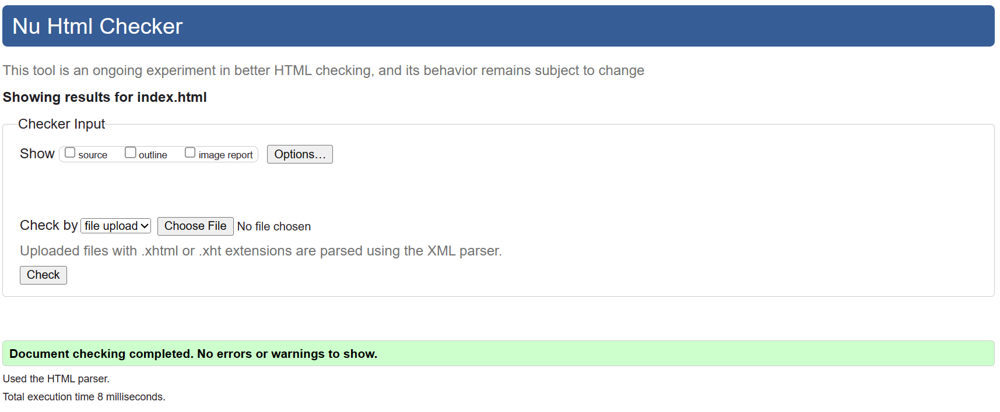

# **Tribe**
## **Site Overview**
Welcome to Tribe - the number one destination for the African and Caribbean community. Here at Tribe we foster a passion to connect and enhance the African and Caribbean communities in rural areas. Connect with others by joining activities being hosted by people like yourself, or host your own activity. Find Black Owned businesses providing the products and services you need, using the business directory. Build new relationships with the secure profile portal which includes a chat function. 

## Table of contents:
1. [**Site Overview**](#site-overview)
1. [**Planning stage**](#planning-stage)
    * [***Target Audiences***](#target-audiences)
    * [***User Stories***](#user-stories)
    * [***Site Aims***](#site-aims)
    * [***How Is This Will Be Achieved:***](#how-this-will-be-achieved)
    * [***Wireframes***](#wireframes)
    * [***Color Scheme***](#color-scheme)
    * [***Technology Used***](#Technology-Used)
    * [***Languages Used***](#Languages-Used)
    * [***Frameworks, Libraries & Programs Used***](#Frameworks,-Libraries-&-Programs-Used)
1. [**Current Features Common to all pages**](#current-features-common-to-all-pages)
    * [***Header Element:***](#header-element)
        * [*Title*](#title)
        * [*Logos*](#logos)
        * [*Navigation Bar*](#navigation-bar)
        * [*African Print Design*](#African-Print-Design)    
    * [**Footer**](#footer)
1. [**Future-Enhancements**](#future-enhancements)
1. [**Testing Phase**](#testing-phase)
        * [*Testing*](#Testing)
        * [*Testing User Stories from User Experience (UX) Section*](#Testing-User-Stories-from-User-Experience-(UX)-Section)        
        * [*Further Testing*](#Further-Testing)
1. [**Accessibility**](#Accessibility)
1. [**Known Bugs**](#Known-Bugs)
1. [**Deployment**](#deployment)
1. [**Credits**](#credits)
    * [**Honourable mentions**](#honorable-mentions)
    * [**General reference**](#general-reference)
    * [**Content**](#content)
    * [**Media**](#media)

## **Planning stage**
### **Target Audiences:**
* Members of the African and Caribbean Community 
* Users who want to meet others, explore their local area and foster new relationships.
* Users who are looking for businesses which represent their needs.
* Users who own businesses which the target audience would be interested in.

### **User Stories:**
* As a user, I want to see upcoming events.
* As a user, I want to be able to search for events based on certain search criteria e.g. location, date, activity type.
* As a user, I want to navigate through the site with ease.
* As a user, I want to know my information is secure to enable me to interact with others confidently.
* As a user, I want the ability to find businesses local to me which offer the product or service for my needs.

### **Site Aims:**
* To create a safe and welcoming, dedicated space for the African and Caribbean community.
* To provide activities to promote social interactions, cultural connections, relationship building, business awareness and a sense of community.
* Represent the African and Caribbean community
* Enable users to interact with the site through their profile, hosting activities and promoting their business.

### **How This Will Be Achieved:**
* The Activities page will showcase upcoming activities for users to RSVP.
* When users are logged into the site they will see the activities sign up for and the ability to contact others, with a profile, who are also attending the activity and the host.
* Activities can be filtered based on popular search criteria e.g. location, activity type.
* Users will be able to log into a profile and personalise this to enable communication with others and the activity host - using a verification process. (users who are not logged in can send RSVP or questions using the feedback forms provided.) 

* Notifications can be turned on to enable users with an account to receive updates.

### **Wireframes:**
I used Balsamiq to create a visual representation of the Tribe site - below are the initial idea designs:

* Desktop Wireframes:
    * 
    * 
    * 
    * 

There was some deviation from the original wireframes due to time and additional functionality needed to support the designs.

* The Business page were not created due to the need for backend functionality which was out of the scope of this project.
* The signup page also required the need for backend functionality, a standard form is used to enable people to RSVP to events on the activities page, currently, and the sign in page has been omitted until the backend functionality is available.
* The ability to search and use a map functionality also required backend functionality and were left out at this stage.
* To improve the User experience, the hero image was removed from all pages except the index page, as users could not differentiate between pages when using the navigation bar until they scrolled down. 

### **Color Scheme:**
I wanted the colour scheme to be a dark colour which contrasted a white background, I choose rgba(153,30,2, 1) Totem pole for the main background colours and the main font colours. Contrasting with a white font colour against the totem pole background. I have also used black font in places where I felt it was needed to differentiate between areas. 

This color also complimented the African print design I wanted to incorporate into the website - I used this as a background on the activity elements of the site.

### **Technology Used:**
## Languages Used

-   [HTML5](https://en.wikipedia.org/wiki/HTML5)
-   [CSS3](https://en.wikipedia.org/wiki/Cascading_Style_Sheets)

### Frameworks, Libraries & Programs Used

1. [Hover.css:](https://ianlunn.github.io/Hover/)
    - Hover.css was used on the navigation links
1. [Font Awesome:](https://fontawesome.com/)
    - Font Awesome was used on the forms on the activity page, alongside the social media icons within the footer.
1. [Git](https://git-scm.com/)
    - Git was used for version control by utilizing the command line terminal to commit to Git and Push to GitHub.
1. [GitHub:](https://github.com/)
    - GitHub was used to store the project code after being pushed from Git.
1. [Canva:](https://www.canva.com/)
    - Canva was used to create the logo and to create the hero image.
1. [Balsamiq:](https://balsamiq.com/)
    - Balsamiq was used to create the wireframes during the design process.
1. [ImageColorPicker:](https://imagecolorpicker.com/)
    -Image Color Picker was used to select the colors for my background, container backgrounds and text. 
1. [Activities gallery:] (https://www.w3schools.com/css/css3_3dtransforms.asp) 
    - code referenced to make the gallery on the activities page interactive. 

## **Current Features Common to all pages**
###  **Main body**
The header is used throughout the site to hold the navigation bar and the site title.

### *Logos:*
* Although a logo was created, I found this difficult to align on the page, so it was omitted due to time restraints.

### *Navigation Bar:*
* The navigation bar appears on all three pages. 
* It contains links to the Activities and About pages.

### *African Print Design:*
* This print was integral to ensure there was a recognisable cultural element within the site - this is used as a border around activities.

## **Footer**
* The footer holds icons to access social media sites and an email functionality to contact us, this is replicated throughout the site.

## **Future-Enhancements**

* In the future, this site will enable locality hubs - to enable nation-wide activities.

* I would also like to include activities which are based abroad, female only trips etc.

* I would also like to host business podcasts or a blog, where Black Owned businesses could talk more about their services or products and where start ups could connect with the established community and gain resources while they start their entrepreneurial journey.

* With the backend functionality I will be able to include aspects like searchable activities and businesses, a profile area and chat function.

* There should also be a payment element to enable bigger activities where a charge/booking fee/ reservation fee may be needed. 

* To support growth, I will link social media and google accounts. I will also enable sign up functionality where I can store and use contact information for marketing and promotional material.

### **Testing Phase**

## **Testing**

The W3C Markup Validator and W3C CSS Validator Services were used to validate every page of the project to ensure there were no syntax errors in the project.

-   [W3C Markup Validator](https://validator.w3.org/nu/) 
    
    Homepage:

    Initial tests show various errors to be corrected.
    
    After fixing the errors, the final test results confirm no errors or warnings.
    

    Event Page:

    Initial tests show various errors to be corrected.
    
    After fixing the errors, the final test results confirm no errors or warnings.
    

    About:

    Initial tests show various errors to be corrected.
    
    After fixing the errors, the final test results confirm no errors or warnings.
    

-   [W3C CSS Validator](https://jigsaw.w3.org/css-validator) 

    CSS:

    Initial tests show various errors to be corrected.
    
    After fixing the errors, the final test results confirm no errors or warnings.
    

    However, the initial test on the stylesheet showed the use of webkit within the backface code (lines 227 and 237) were not best practice. After removing these the images in firefox for the activities page do not perform the same as their counterparts on the Edge browser. 

    I have included a screenshot of compatibility for the use of backface across the browsers, I am unable to investigate further due to time restraints.
    

### Testing User Stories from User Experience (UX) Section

1. As a user, I want to see upcoming events.

    1. On the homepage users are greeted with the featured events happening during the month. Users can then click through to view all the events on offer during the month. 

    2.
        
2. As a user, I want to be able to search for events based on certain search criteria.
    1. This functionality would have been incorporated into the interactive map on the events page. The user would have been able to filter the upcoming events by a specific category e.g. child-friendly, outdoors etc.
    2. Due to the extensive javascript usage, this was outside of the scope of this project currently. 

3. As a user, I want to navigate through the site with ease.
    1. The navigation bar is simple and allows the user to direct their search to the relevant areas of the site. Alongside, specific links of interest within bodies of text to further support the users navigation and sign up to events.
    

4. As a user, I want to know my information is secure to enable me to interact with others confidently.
    1. Users can securely send there sign up to events requests via the system. Alongside, use the contact us logo at the bottom of each page.
    2. At this stage of the build, the functionality for chat, sign-in and profile pages has not been implemented. 

5. As a user, I want the ability to find businesses local to me which offer the product or service for my needs.
    1. The business directory section of the website, although not installed yet, would have housed local businesses specialising in African and Caribbean products and services. Allowing the user to find new businesses to support and utilise a wider pool of businesses local to them. 
    

6. To create a safe and welcoming, dedicated space for the African and Caribbean community.
    1. The site boosts a deep red colour promoting the feeling of warmth and a homely cozy feeling.
    2. The African Tribal print, also features the same deep red colour, which helps tie the colour scheme together. 
    3. The tribal print also supports the users to know who the site is targeted towards, without using words - which could cause misunderstanding.

7. To provide activities to promote social interactions, cultural connections, relationship building, business awareness and a sense of community.
    1. There are various activities available for users to engage with, alongside the option of them submitting their own event for others to join. This ensures all hobbies and interests are covered and those wanting to try new activities can find others. 
    2. The chat functionality would have also further promted relationship building as users would have seen who else was attending the event, could have started conversations and can see what events those they have already met are attending. 

8. Represent the African and Caribbean community
    1. Representation comes from the images and tribal print used throughout the site.
    2. Tee inclusion of Black Owned businesses local to the users location further prompts the sense of community.

9. Enable users to interact with the site through their profile, hosting activities and promoting their business.
    1. The profile element would have included the users interests, occupation, relationship/children status - attributes which would support the conversation and relationship building while on the site. 
    2. This is important as there are situations where people without children want to interact with others without children, as one example. conversely, married users may want to meet other married couples to further extend their connections. 
    3. Users can submit their own business or submit suggests of businesses they have come across which other users would benefit from having on the site. 

### Further Testing

-   The Website was tested on Google Chrome, Internet Explorer and Microsoft Edge.
-   The website was viewed on a variety of devices such as Desktop, Laptop and android phones.
-   A large amount of testing was done to ensure that all pages were linking correctly.
-   Friends and family members were asked to review the site and documentation to point out any bugs and/or user experience issues.

### Accessibility
I wanted to ensure the site supported all visitors, I included the following in my code to ensure this:

* All images contained an alt tag
* All images were converted into WEBP, a reduced file size to support the load time of images (https://convertio.co/webp-converter/)
* The site is responsive to different screen sizes 
* I used semantic elements throughout the design

### ***Known Bugs***

* adding the bootstrap link caused the border image to disable. 
    - Solution:  removed bootstrap link and used CSS to obtain result.
* adding event listener to map caused map to disappear 
 
    - Solution: although I was able to fix this bug by editing the code, I did remove this functionality due to increased need for javascript to fully deliver what I wanted from the map. 
* I was unable to see why the middle image on the index.html page was longer than the other images. From using the inspect tool - all attributes for the three containers were the same. 
    - solution: bug not fixed due to time restraints. 
* There is a slight delay in the text re-sizing as the page is re-sized and overflows from the container on the events page. 
    - solution: bug not fixed due to time restraints
* I was unable to change the nav bar to be on one line when the screen size was a laptop or bigger. It is currently stacked.
    -solution: bug not fixed due to time restraints.    

## **Deployment**
I deployed the page on GitHub pages via the following procedure: -

1. From the project's [repository](https://github.com/AdelleKing/Tribe), go to the **Settings** tab.
2. From the left-hand menu, select the **Pages** tab.
3. Under the **Source** section, select the **Main** branch from the drop-down menu and click **Save**.
4. A message will be displayed to indicate a successful deployment to GitHub pages and provide the live link.

***
## **Credits**
### **Honourable mentions**
This project could not have happened without the support of the following people listed in no particular order:

* [Komal Karir ](https://github.com/kkarir-waes) - My course tutor who was always on hand whenever I had a question and also provided great insight into the world of software development.

* Luke Buchanan - My Code Institute mentor was able to see what I was trying to create and helped me simplify my code - a lot of 'Oh I see' moments - thank you.

* The slack channels and other online support forums where I found a wealth of information, great inspiration and the courage to carry on through the difficult times of this project.

### **General reference:**
* I really enjoyed using this website, the use of borders and colours really engaged me. I was unable to use any of the inspiration from this site in my own as the imagery was graphic design based.[Peanut](https://www.peanut-app.io/about-us)

* I relied upon W3schools, youtube and stack overflow for general "how to's" throughout the project alongside course material from Code Institute. 

### **Content:**
* Most of the content was written by myself.
* Icons in the forms were taken from [Font Awesome](https://fontawesome.com) 

### **Media:**
* Images used for activities were taken from [Pexels](https://www.pexels.com/)
* The Hero image was created by myself using canva and personally taken photos. 